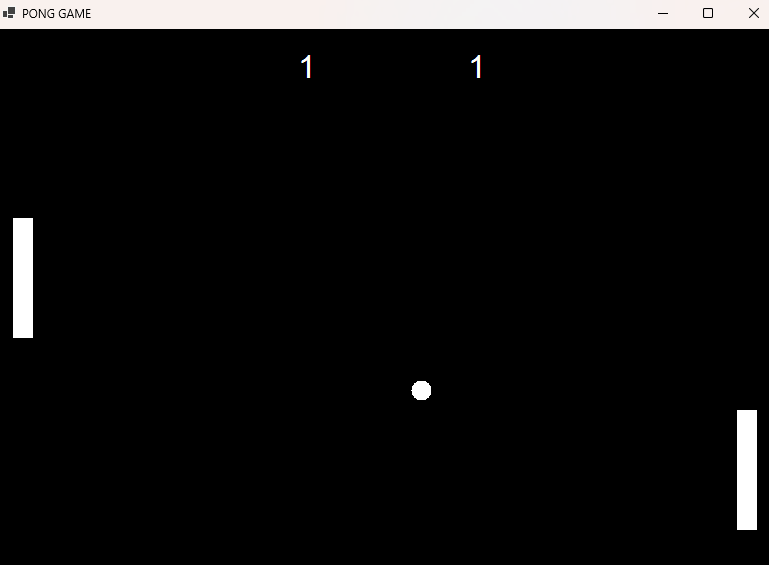
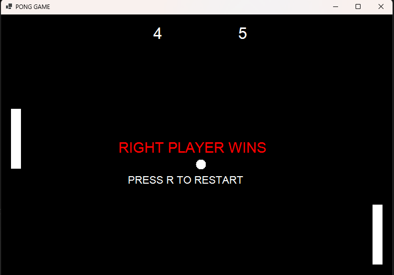
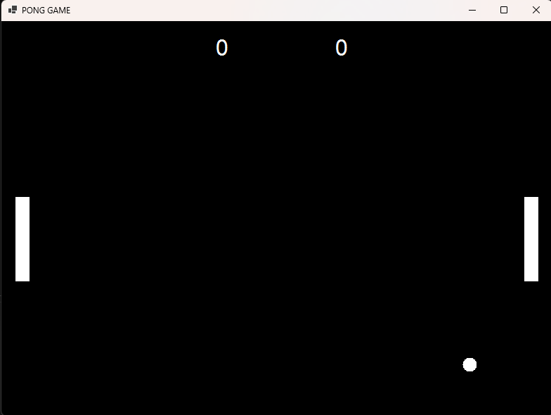

# Pong Game - Εργασία ΙΕΚ
---

# Περιγραφή Project
Το συγκεκριμένο project είναι ένα παιχνίδι τύπου Pong, υλοποιημένο σε C# Windows Forms.
Το παιχνίδι είναι multiplayer για 2 παίκτες και βασίζεται στην κλασική λογική του retro Pong game.
Οι παίκτες χειρίζονται δύο ρακέτες και προσπαθούν να αποκρούσουν την μπάλα ώστε να σκοράρουν απέναντι στον αντίπαλο.
---
# Στόχοι της Εφαρμογής
---
Εξοικείωση με την C#

Χρήση Windows Forms

Διαχείριση keyboard input

Δημιουργία game loop

Collision Detection

Χρήση αντικειμένων Rectangle

Χρήση γραφικών μέσω Graphics

Ανάπτυξη λογικής παιχνιδιού
---
# Τεχνολογίες
---
Γλώσσα: C#

Framework: .NET Windows Forms

IDE: Visual Studio

Gameplay
Το παιχνίδι περιλαμβάνει:

2 ρακέτες

1 μπάλα

Σύστημα score

Collision system

Game Over screen

Restart λειτουργία

Ο πρώτος παίκτης που θα φτάσει τους 5 πόντους κερδίζει το παιχνίδι.

# Χειρισμός Παιχνιδιού
ΠαίκτηςΚίνηση ΠάνωΚίνηση ΚάτωLeft PlayerWSRight Player↑ Arrow↓ Arrow
Restart

Πατήστε R μετά το Game Over για επανεκκίνηση.

# Λογική Κώδικα
---
Το παιχνίδι χρησιμοποιεί ένα Timer που λειτουργεί σαν game loop και ενημερώνει συνεχώς:

την κίνηση της μπάλας
τις ρακέτες
το score
τα collisions

Για τα collisions χρησιμοποιείται η κλάση Rectangle και η μέθοδος:

IntersectsWith()

Όταν η μπάλα χτυπά ρακέτα αλλάζει κατεύθυνση και αυξάνεται λίγο η ταχύτητα.

Τα γραφικά σχεδιάζονται μέσα από τη μέθοδο:

OnPaint()
Features
2 Player Gameplay
Score System
Collision Detection
Game Over Screen
Restart Function
Increasing Difficulty

# Τι Έμαθα
---
Μέσα από το project έγινε εξάσκηση σε:

Variables
Conditions
Methods
Events
Game Logic
Graphics
Collision Detection
