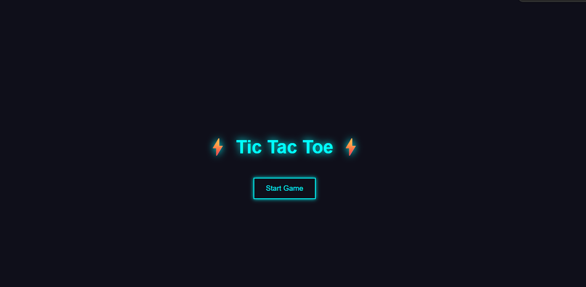
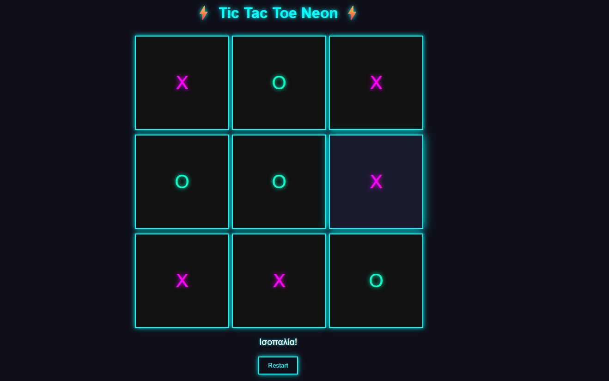
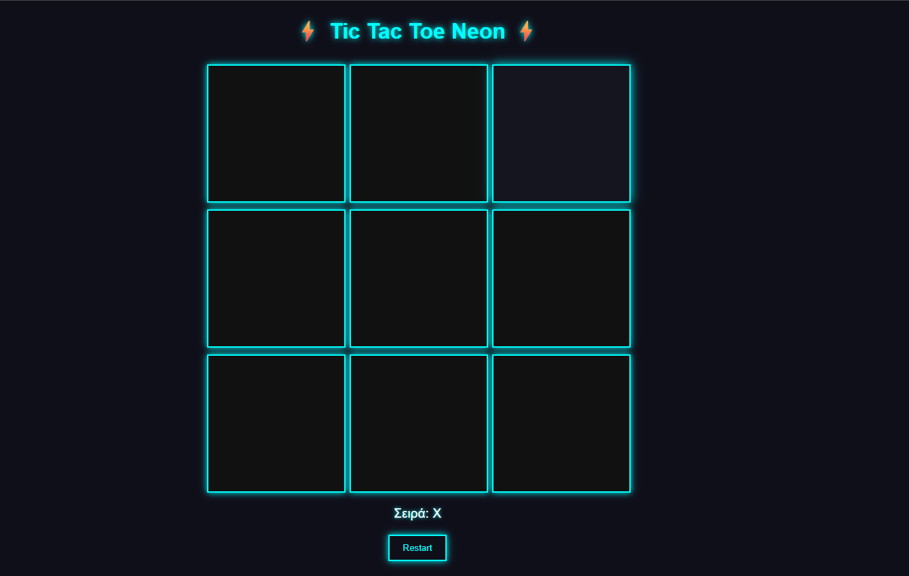

# ⚡ Tic Tac Toe Neon ⚡

<div align="center">







### 🎮 Neon έκδοση του κλασικού Tic Tac Toe  
Κατασκευασμένο με **HTML • CSS • JavaScript**

</div>

---

# 📌 Περιγραφή

Η εφαρμογή υλοποιεί το κλασικό παιχνίδι **Τρίλιζα** για 2 παίκτες.  
Οι παίκτες παίζουν εναλλάξ ως **X** και **O** μέχρι να υπάρξει νικητής ή ισοπαλία.

Το project δημιουργήθηκε ως εργασία σχολής με στόχο την εξάσκηση σε:

- 🧱 HTML DOM Structure
- 🎨 CSS Styling & Animations
- ⚙️ JavaScript Event Handling
- 🧠 Game Logic

---

# 🚀 Λειτουργίες

<div align="center">

| ⚡ Feature | 📖 Περιγραφή |
|---|---|
| 🎮 Start Menu | Αρχική οθόνη εκκίνησης |
| ⚡ Neon UI Design | Futuristic neon σχεδιασμός |
| 🔄 Restart Button | Επανεκκίνηση παιχνιδιού |
| ✅ Win Detection | Έλεγχος νικητή |
| 🤝 Draw Detection | Έλεγχος ισοπαλίας |
| 👥 Player Turns | Εναλλαγή παικτών |
| 📱 Responsive Layout | Προσαρμογή σε διαφορετικές οθόνες |

</div>

---

# 🛠 Τεχνολογίες

<div align="center">

| 🌐 Frontend | 🎨 Styling | ⚙️ Logic |
|---|---|---|
| HTML5 | CSS3 | Vanilla JavaScript |

</div>

---

# 📂 Δομή Project

<div align="center">

</div>

```bash
project-folder/
│
├── tic-tac-toe.html
├── style.css
├── script.js
└── README.md

<div align="center">
🎮 Gameplay
🔹 Ο παίκτης X ξεκινά πρώτος
🔹 Οι παίκτες πατάνε σε ένα κελί για να τοποθετήσουν το σύμβολό τους
🔹 Το παιχνίδι ελέγχει αυτόματα νίκη, ισοπαλία και αλλαγή σειράς
</div>

<div align="center">
⚙️ Functionality
addEventListener() για clicks
Πίνακες για τα winning patterns
DOM Manipulation
Condition Checking για game states
</div>

💡 Features Preview
<div align="center">
✨ Features
⚡ Dynamic Neon Effects
🎮 Interactive Gameplay
🧠 Real-time Winner Detection
🔄 Instant Restart System
</div>

